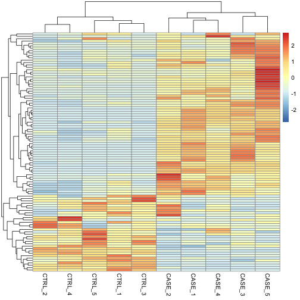
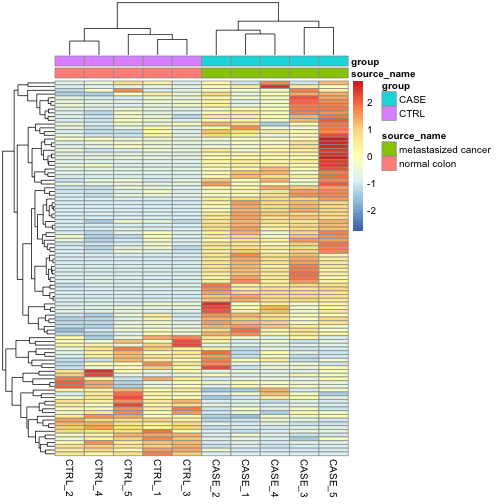
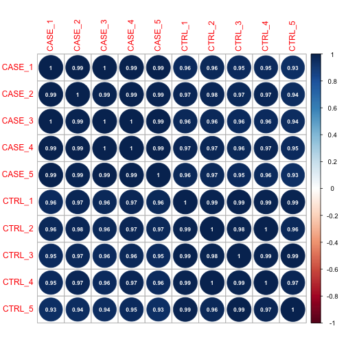
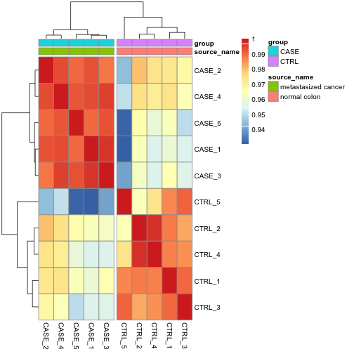
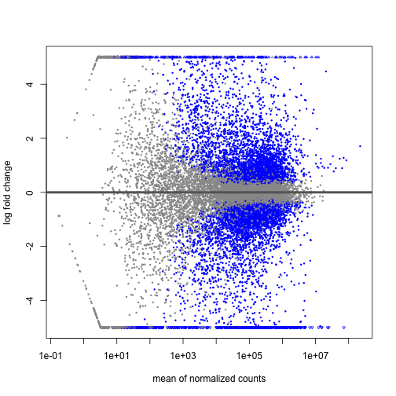
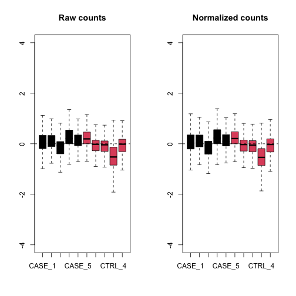
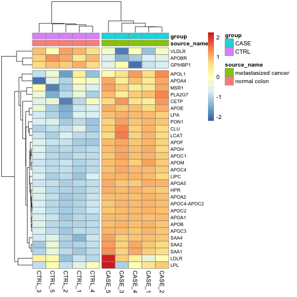
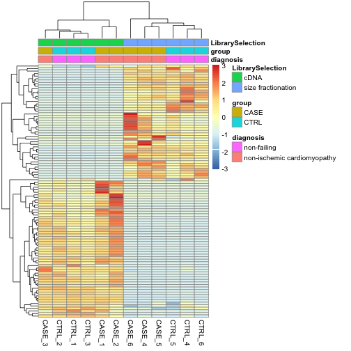

# RNA-seq

### Loading the data

Dataset obtained from a study to identify prognostic signature of colorrectal cancer (CRC) patients.
The data was obtained from the NCBI Sequence Read Archive (SRA) under the accession number SRP029880.
RNA-seq data was generated using 54 samples (normal colon, primary CRC, and liver metastasis) obtained from 
18 patients. The data was then used to to identify significant genes associated with CRC progression.


```r
counts_file <- system.file("extdata/rna-seq/SRP029880.raw_counts.tsv",
                           package = "compGenomRData")
coldata_file <- system.file("extdata/rna-seq/SRP029880.colData.tsv",
                            package = "compGenomRData")

counts <- as.matrix(read.table(counts_file, header = T, sep = '\t'))
```
### Computing CPM

```r
summary(counts[,1:3])
```

```
##      CASE_1              CASE_2              CASE_3         
##  Min.   :        0   Min.   :        0   Min.   :        0  
##  1st Qu.:     5155   1st Qu.:     6464   1st Qu.:     3972  
##  Median :    80023   Median :    85064   Median :    64145  
##  Mean   :   295932   Mean   :   273099   Mean   :   263045  
##  3rd Qu.:   252164   3rd Qu.:   245484   3rd Qu.:   210788  
##  Max.   :205067466   Max.   :105248041   Max.   :222511278
```

```r
# Computing cpm for each sample
cpm <- apply(subset(counts, select = c(-width)), 2,
             function(x) x / sum(as.numeric(x)) * 10^6)

# Diplaying results across all samples
colSums(cpm)
```

```
## CASE_1 CASE_2 CASE_3 CASE_4 CASE_5 CTRL_1 CTRL_2 CTRL_3 CTRL_4 CTRL_5 
##  1e+06  1e+06  1e+06  1e+06  1e+06  1e+06  1e+06  1e+06  1e+06  1e+06
```

### Computing RPKM

```r
geneLengths <- as.vector(subset(counts, select = c(width)))

# Compute rpkm
rpkm <- apply(X = subset(counts, select = c(-width)), 
              MARGIN = 2,
              FUN = function(x) {
                  10^9 * x / geneLengths / sum(as.numeric(x))
                })

# Diplaying results across all samples
colSums(rpkm)
```

```
##   CASE_1   CASE_2   CASE_3   CASE_4   CASE_5   CTRL_1   CTRL_2   CTRL_3   CTRL_4   CTRL_5 
## 158291.0 153324.2 161775.4 173047.4 172761.4 210032.6 301764.2 241418.3 291674.5 252005.7
```

### Computing TPM

```r
# Gene lengths normalized values
rpk <- apply( subset(counts, select = c(-width)), 2,
              function(x) x / (geneLengths / 1000))

# Normalize by sample size using rpk
tpm <- apply(rpk, 2, function(x) x / sum(as.numeric(x)) * 10^6)

# Diplaying results across all samples
colSums(tpm)
```

```
## CASE_1 CASE_2 CASE_3 CASE_4 CASE_5 CTRL_1 CTRL_2 CTRL_3 CTRL_4 CTRL_5 
##  1e+06  1e+06  1e+06  1e+06  1e+06  1e+06  1e+06  1e+06  1e+06  1e+06
```

### Clustering

```r
# Computing variance across samples
variance <- apply(tpm, 1, var)

# Sorting by decreasing variance and selecting the top 100 genes
selectedGenes <- names(variance[order(variance, decreasing = T)][1:100])

# Creating a heatmap of gene/sample clustering
library(pheatmap)
pheatmap(tpm[selectedGenes,], scale = "row", show_rownames = F)
```



```r
# Recreating the heatmap with some annotation of the various attributes
colData <- read.table(coldata_file, header = T, sep = '\t',
                      stringsAsFactors = T)
pheatmap(tpm[selectedGenes,], scale = "row",
         show_rownames = F,
         annotation_col = colData)
```



### PCA plotting

```r
library(stats)
library(ggplot2)
# Obtaining tranpose of the matrix
M <- t(tpm[selectedGenes,])

# Transform to log2 scale
M <- log2(M + 1)

# Calculating PCA
pcaResults <- prcomp(M)

# Plotting the PCA
autoplot(pcaResults, data = colData, colour = "group")
```

```
## Error in `autoplot()`:
## ! Objects of class <prcomp> are not supported by autoplot.
## ℹ have you loaded the required package?
```

```r
# Returning a summary of the PCA
summary(pcaResults)
```

```
## Importance of components:
##                           PC1     PC2     PC3     PC4     PC5    PC6     PC7     PC8     PC9      PC10
## Standard deviation     24.396 2.50514 2.39327 1.93841 1.79193 1.6357 1.46059 1.30902 1.12657 1.158e-14
## Proportion of Variance  0.957 0.01009 0.00921 0.00604 0.00516 0.0043 0.00343 0.00276 0.00204 0.000e+00
## Cumulative Proportion   0.957 0.96706 0.97627 0.98231 0.98747 0.9918 0.99520 0.99796 1.00000 1.000e+00
```

### Correlation plots

```r
corrMatrix <- cor(tpm)

# Plotting the correlation matrix
library(corrplot)
```

```
## corrplot 0.92 loaded
```

```r
corrplot(corrMatrix, method = "circle",
         addrect = 2, addCoef.col = "white",
         number.cex=0.7)
```



```r
# Replotting the correlation using a heatmap
pheatmap(corrMatrix, annotation_col = colData,
         cutree_cols = 2)
```



### Differential expression analysis
* Allows for testing tens of thousands of hypotheses against the null hypothesis that the activity
  of the gene stays the same in two different conditions.
* Model assumes that for each gene, the read counts are generated by negative binomial distribution 


```r
# Loading the DESeq2 package
library(DESeq2)
```

```
## Loading required package: S4Vectors
```

```
## Loading required package: stats4
```

```
## Loading required package: BiocGenerics
```

```
## 
## Attaching package: 'BiocGenerics'
```

```
## The following objects are masked from 'package:stats':
## 
##     IQR, mad, sd, var, xtabs
```

```
## The following objects are masked from 'package:base':
## 
##     anyDuplicated, aperm, append, as.data.frame, basename, cbind, colnames, dirname, do.call, duplicated,
##     eval, evalq, Filter, Find, get, grep, grepl, intersect, is.unsorted, lapply, Map, mapply, match, mget,
##     order, paste, pmax, pmax.int, pmin, pmin.int, Position, rank, rbind, Reduce, rownames, sapply,
##     setdiff, sort, table, tapply, union, unique, unsplit, which.max, which.min
```

```
## 
## Attaching package: 'S4Vectors'
```

```
## The following objects are masked from 'package:base':
## 
##     expand.grid, I, unname
```

```
## Loading required package: IRanges
```

```
## Loading required package: GenomicRanges
```

```
## Loading required package: GenomeInfoDb
```

```
## Loading required package: SummarizedExperiment
```

```
## Loading required package: MatrixGenerics
```

```
## Loading required package: matrixStats
```

```
## 
## Attaching package: 'MatrixGenerics'
```

```
## The following objects are masked from 'package:matrixStats':
## 
##     colAlls, colAnyNAs, colAnys, colAvgsPerRowSet, colCollapse, colCounts, colCummaxs, colCummins,
##     colCumprods, colCumsums, colDiffs, colIQRDiffs, colIQRs, colLogSumExps, colMadDiffs, colMads, colMaxs,
##     colMeans2, colMedians, colMins, colOrderStats, colProds, colQuantiles, colRanges, colRanks,
##     colSdDiffs, colSds, colSums2, colTabulates, colVarDiffs, colVars, colWeightedMads, colWeightedMeans,
##     colWeightedMedians, colWeightedSds, colWeightedVars, rowAlls, rowAnyNAs, rowAnys, rowAvgsPerColSet,
##     rowCollapse, rowCounts, rowCummaxs, rowCummins, rowCumprods, rowCumsums, rowDiffs, rowIQRDiffs,
##     rowIQRs, rowLogSumExps, rowMadDiffs, rowMads, rowMaxs, rowMeans2, rowMedians, rowMins, rowOrderStats,
##     rowProds, rowQuantiles, rowRanges, rowRanks, rowSdDiffs, rowSds, rowSums2, rowTabulates, rowVarDiffs,
##     rowVars, rowWeightedMads, rowWeightedMeans, rowWeightedMedians, rowWeightedSds, rowWeightedVars
```

```
## Loading required package: Biobase
```

```
## Welcome to Bioconductor
## 
##     Vignettes contain introductory material; view with 'browseVignettes()'. To cite Bioconductor, see
##     'citation("Biobase")', and for packages 'citation("pkgname")'.
```

```
## 
## Attaching package: 'Biobase'
```

```
## The following object is masked from 'package:MatrixGenerics':
## 
##     rowMedians
```

```
## The following objects are masked from 'package:matrixStats':
## 
##     anyMissing, rowMedians
```

```r
# Removing width column from original counts matrix
countData <- as.matrix(subset(counts, select = c(-width)))

# Defining design formula
designFormula <- "~ group"

# Creating DESeq2 object
dds <- DESeqDataSetFromMatrix(countData = countData,
                              colData = colData,
                              design = as.formula(designFormula))
```

```
## converting counts to integer mode
```

```r
# Printing dds object
print(dds)
```

```
## class: DESeqDataSet 
## dim: 19719 10 
## metadata(1): version
## assays(1): counts
## rownames(19719): TSPAN6 TNMD ... MYOCOS HSFX3
## rowData names(0):
## colnames(10): CASE_1 CASE_2 ... CTRL_4 CTRL_5
## colData names(2): source_name group
```

```r
# rownames(dds) displays the gene names
# colData(dds) displays the sample information
# counts(dds) displays the raw counts
# colData(dds) displays experimental setup

# Removing genes that contain at least 1 read
dds <- dds[rowSums(DESeq2::counts(dds)) > 1,]

# Creating DESeqDataSet object using DESeq()
dds <- DESeq(dds)
```

```
## estimating size factors
```

```
## estimating dispersions
```

```
## gene-wise dispersion estimates
```

```
## mean-dispersion relationship
```

```
## final dispersion estimates
```

```
## fitting model and testing
```

```r
# Printing results
DEresults <- results(dds, contrast = c("group", "CASE", "CTRL"))

# Sorting results by increasing p-value and printing them
DEresults <- DEresults[order(DEresults$pvalue),]
print(DEresults)
```

```
## log2 fold change (MLE): group CASE vs CTRL 
## Wald test p-value: group CASE vs CTRL 
## DataFrame with 19097 rows and 6 columns
##             baseMean log2FoldChange     lfcSE       stat       pvalue         padj
##            <numeric>      <numeric> <numeric>  <numeric>    <numeric>    <numeric>
## CYP2E1       4829889        9.36024  0.215223    43.4909  0.00000e+00  0.00000e+00
## FCGBP       10349993       -7.57579  0.186433   -40.6355  0.00000e+00  0.00000e+00
## ASGR2         426422        8.01830  0.216207    37.0863 4.67898e-301 2.87741e-297
## GCKR          100183        7.82841  0.233376    33.5442 1.09479e-246 5.04945e-243
## APOA5         438054       10.20248  0.312503    32.6477 8.64906e-234 3.19133e-230
## ...              ...            ...       ...        ...          ...          ...
## CCDC195      20.4981      -0.215607   2.89255 -0.0745386           NA           NA
## SPEM3        23.6370     -22.154753   3.02785 -7.3169989           NA           NA
## AC022167.5   21.8451      -2.056240   2.89545 -0.7101618           NA           NA
## BX276092.9   29.9636       0.407326   2.89048  0.1409199           NA           NA
## ETDC         22.5675      -1.795274   2.89421 -0.6202983           NA           NA
```

First 3 lines show statistical tests used to calculate the results and dimensions of the results table.
baseMean represents the average normalzied expression of the gene across all considered samples.
log2FoldChange respresents the log2 fold change of the normalized expression of the gene.
lfcSE represents the standard error of the log2 fold change.
stat is the statistics calculated in the test which translates to p-value

### Downstream Analysis
* Tests to imrpove confidence about quality of the data and the experimental design

MA plot is used to observe if data normalization was successful. X-axis represents the average of the 
normalized counts across samples and y-axis denotes the log fold change.

```r
DESeq2::plotMA(dds, ylim = c(-5, 5))
```



A RLE (relative log expression) plot is useful to find out if the data needs to be normalized.

```r
library(EDASeq)
```

```
## Loading required package: ShortRead
```

```
## Loading required package: BiocParallel
```

```
## Loading required package: Biostrings
```

```
## Loading required package: XVector
```

```
## 
## Attaching package: 'Biostrings'
```

```
## The following object is masked from 'package:base':
## 
##     strsplit
```

```
## Loading required package: Rsamtools
```

```
## Loading required package: GenomicAlignments
```

```r
par(mfrow = c(1, 2))

# Creating RLE plots
plotRLE(countData, outline=F, ylim=c(-4, 4),
        col=as.numeric(colData$group),
        main = "Raw counts")
plotRLE(DESeq2::counts(dds), normalized = T,
        outline=F, ylim=c(-4, 4),
        col = as.numeric(colData$group),
        main = "Normalized counts")
```



### Function Enrichment Analysis
* Gene Ontology Consortium has collected Gene Ontology (GO) terms for each gene.
* GO term analysis helps quickly find out systematic changes that can describe differences between groups
  of samples.


```r
library(gProfileR)
library(knitr)

# Getting the DEresults again
DEresults <- results(dds, contrast = c("group", "CASE", "CTRL"))

# Removing NA values
DE <- DEresults[!is.na(DEresults$padj),]

# Selecting genes with adjusted p-value < 0.1 and log2 fold change > 1
DE <- DE[abs(DE$log2FoldChange) > 1 & DE$padj < 0.1,]

# Getting the gene names
genes <- rownames(DE)

# Calculating the GO enrichment terms
goResults <- gprofiler(query = genes,
                       organism = "hsapiens",
                       src_filter = "GO",
                       hier_filtering = "moderate")
```

```
## Warning: Please consider using the new package "gprofiler2". At the moment you are using a deprecated package relying on outdated data.
##   More information at https://biit.cs.ut.ee/gprofiler/page/r-new. Feel free to contact us at biit.support@ut.ee for further help.
```

```r
# Ordering results by increasing p-value
goResults <- goResults[order(goResults$p.value),]

# Keeping terms that have the most out of 100 overlapping genes
go <- goResults[goResults$overlap.size < 100,]

# Using top term to create gene set
geneSet1 <- unlist(strsplit(go[1,]$intersection, ","))

# Creating another gene set using 25 randomly selected genes
normalizedCounts <- DESeq2::counts(dds, normalized = T)
geneSet2 <- sample(rownames(normalizedCounts), 25)

# Creating a list of gene sets
geneSets <- list( "top_GO_term" = geneSet1,
                  "random_genes" = geneSet2)

# Creating group comparison between case samples and control samples
library(gage)
```

```
## 
```

```r
gseaResults <- gage(exprs = log2(normalizedCounts + 1),
            ref = match(rownames(colData[colData$group == "CTRL",]),
                        colnames(normalizedCounts)),
            samp = match(rownames(colData[colData$group == "CASE",]),
                         colnames(normalizedCounts)),
            gsets = geneSets, compare = "as.group")

print(gseaResults$greater)
```

```
##                 p.geomean  stat.mean        p.val        q.val set.size         exp1
## top_GO_term  2.613981e-09  7.1993998 2.613981e-09 5.227961e-09       32 2.613981e-09
## random_genes 7.693738e-01 -0.7435834 7.693738e-01 7.693738e-01       25 7.693738e-01
```

```r
print(gseaResults$less)
```

```
##              p.geomean  stat.mean     p.val     q.val set.size      exp1
## random_genes 0.2306262 -0.7435834 0.2306262 0.4612524       25 0.2306262
## top_GO_term  1.0000000  7.1993998 1.0000000 1.0000000       32 1.0000000
```

```r
# Creating a heatmap visualizing no sigificant up- or down-regulation of genes 
M <- normalizedCounts[rownames(normalizedCounts) %in% geneSet1,]

# log transform counts for visualization

pheatmap(log2(M+1),
         annotation_col = colData,
         show_rownames = T,
         fontsize_row = 8,
         scale = "row",
         cutree_cols = 2,
         cutree_rows = 2)
```



### Accounting for sources of variation

```r
# Using a subset fo the count table obtained for a heart disease survey
counts_file <- system.file('extdata/rna-seq/SRP021193.raw_counts.tsv', 
                           package = 'compGenomRData')
colData_file <- system.file('extdata/rna-seq/SRP021193.colData.tsv', 
                            package = 'compGenomRData')

counts <- read.table(counts_file)
colData <- read.table(colData_file, header = T, sep = '\t', 
                      stringsAsFactors = TRUE)

# First examining how the samples cluster by calculating tpm counts
geneLengths <- counts$width
rpk <- apply(subset(counts, select=c(-width)), 2,
             function(x) x / (geneLengths / 1000))

# Normalize by sample size using rpk values
tpm <- apply(rpk, 2, function(x) x / sum(as.numeric(x)) * 10^6)

selectedGenes <- names(sort(apply(tpm, 1, var),
                            decreasing = TRUE))[1:100]

# Creating heatmap
pheatmap(tpm[selectedGenes,],
         annotation_col = colData,
         show_rownames = F,
         scale = "row")
```



